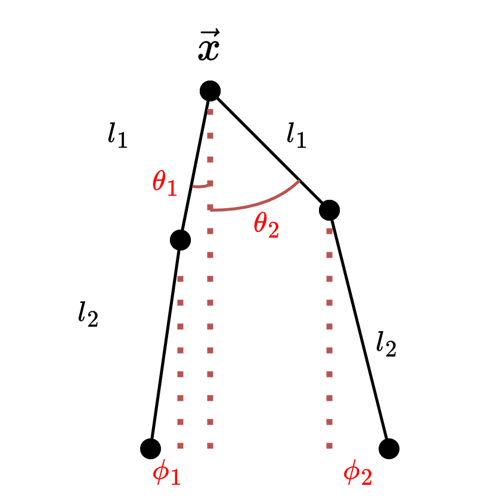
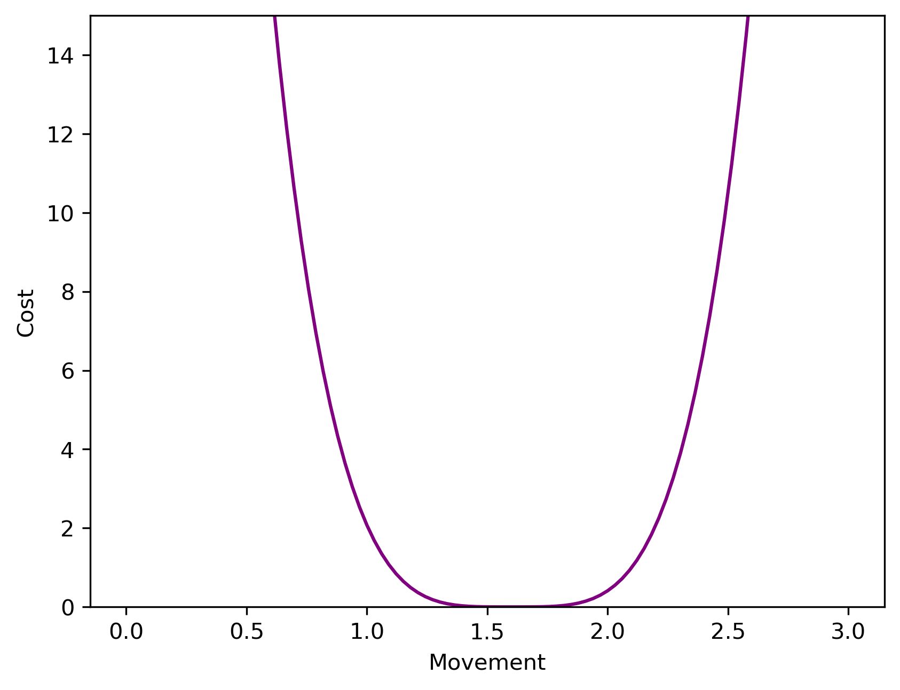

# Biped-Motor-Control
Optimal Control System for Motor Control of a Bipedal Robot

  

# Death on Two Legs, an Optimal Control Simulation

**Authors:** A. Powell, J. Smith, T. Christensen, W. Lewis

## Abstract

We attempt at modelling how to move a biped across terrain. Given a point of connection and 2 legs acting as double-pendulums, we try to minimize the distance between the robots final state and a given point using the angles of each leg as control.

<!--## Background/Motivation  optional do later-->

## Modeling

### Initial Modelling

To model the robot's movement, we are treating the legs as double pendulums while in air but inverted double pendulums while on the ground. A $\theta$ parameter represents the angles of the "thigh" pendulums, and a $\phi$ parameter represents the angle of the "calf" pendulums. Our state $\vec{x}$, represents the position of the top of the legs where they connect (see figure above).

Our model tries to minimize the amount the legs move, and the time spent moving for $\vec{x}$ to reach a final state. We constrain our control to possible angles similar to the standard human range of motion: 

$-10\degree \leq \theta_i \leq 90\degree$
$-90\degree + \theta_i \leq \phi_i \leq 0\degree + \theta_i$

##### In the interest of generating a problem we can solve, we decide to abstract it from real world physics, seeing if we can encourage similar behavior mathematically. In other words, we do not consider things such as friction or mass but instead have rules such as the foot being on the ground fixes it in place or neither foot on the ground causes a negative velocity in the y direction.

Given the constraints in the previous section, we have devised the following cost functional, with our desired final position as $y^*$.

$$\int_0^{t_f}(\alpha_3 u_1)^2 + (\alpha_3 u_2)^2 + (\alpha_4 u_3)^2 + (\alpha_4 u_4)^2 + (\alpha(y - y^*)^4 dt.$$

Since our control is defined on a compact set one might think the optimal control would end up being bang-bang but at any discrete timestep we want to avoid extreme motion in the legs. To achieve this we normalize the control by the desired maximum amount of motion at a timestep (such as 5 degrees of change from one frame to another) and then square this term leading to the $(\alpha_3 u_1)^2$ and similar terms in the cost function.

  

We then call the following our state:

$x_i' = l_2(\phi_i')\cos\phi_i + l1(\theta_i')\cos\theta_i$
$y_i' = l_2(\phi_i')\sin\phi_i + l_1(\theta_i')\sin\theta_i$

This comes from finding the position of the top point of a single double pendulum and then taking the derivative with respect to time to try and find the force it exerts on the point $\vec{x}$. Also note the derivative terms, we handle these by adding them to our control, making it 8-dimensional. 

Then define the following condition:

$c_i = y - (l_1\cos(\theta_i) + l_2\cos(\phi_i)) \leq 0.$$

Therefore, our state equation comes out to

$\vec{x}' = \begin{bmatrix}x' \\ y'\end{bmatrix} $

$x' = x_1' + x_2' \text{  if  } c_1\land c_2\\x_1' \text{  if  } c_1\\ x_2' \text{  if  } c_2\\0 \text{  else  }$
$y' = y_1' + y_2' \text{  if  } c_1\land c_2\\y_1' \text{  if  } c_1\\ y_2' \text{  if  } c_2\\-\alpha_2 \text{  else  }$

#### Model Parameters and Equations

The parameters and equations governing motion in this updated model are listed in the table below.

| Parameter | Description |
|-----------|-------------|
| $h \in \mathbb{R}^{2}$ | Hive position |
| $f_i \in \mathbb{R}^{2}$ | Attractor position (flower) $i \in \{1,\ldots,n \}$ |
| $p_k \in \mathbb{R}^{L}$ | Preference vector of agent k $\in \{1,\ldots,K \}$ |
| $q_i \in \mathbb{R}^{L}$ | Preference vector of attractor $i$ |
| $\alpha$ | Vision distance |
| $b$ | Minimum baseline attraction |
| $T_i$ | Nectar value (time at attractor) |
| $V$ | Max speed |
| $\xi$ | Flight acceleration factor |

## Results

Due to the complicated nature of the problem, our model currently does not produce the desired result when applied via Python. A major problem is defining the evolution of the control when the foot is not on the ground.

With continual improvements to one of the many parameters of the problem, we foresee success with this project. For example, one improvement that we can make to this is changing the ODE that was derived from the cost functions and state equations by making minor changes to the behavior of the cost function or state. Another improvement would be to solve for one step and then feed the final conditions of taking one step into the initial conditions of the next step, thereby discretizing the walk.

From now, our current plan is to iterate on the equations we derived and continually update the code until we determine the optimal control for the bipedal robot. Given we can solve this issue, it can be the basis for more exciting and complicated problems in the future such as different terrain or changing parameters and costs to encourage/allow jumping.

| Grid Size | $\alpha$ | $b$   | $T_i$ | $V$  | $\xi$ |
|-----------|----------|-------|-------|------|-------|
| 100       | 0.005    | 0.01  | 3     | 500  | 0.02  |

#### Learning and Future Directions

The optimization of physical systems can become extremely difficult. Abstracting real world physics into mathematical rules motivated by cost is helpful in order to make this problem solvable in the context of our curriculum.  In the future we hope to redefine the state equation to help motivate 'natural' movement while a leg is not on the ground. We also hope to refine our parameters and the cost function, such as adding a cost for holding a leg in the air for too long. In addition to fixing the models interactions with the floor we hope that these changes will give us a model closer to our desired outcome.
